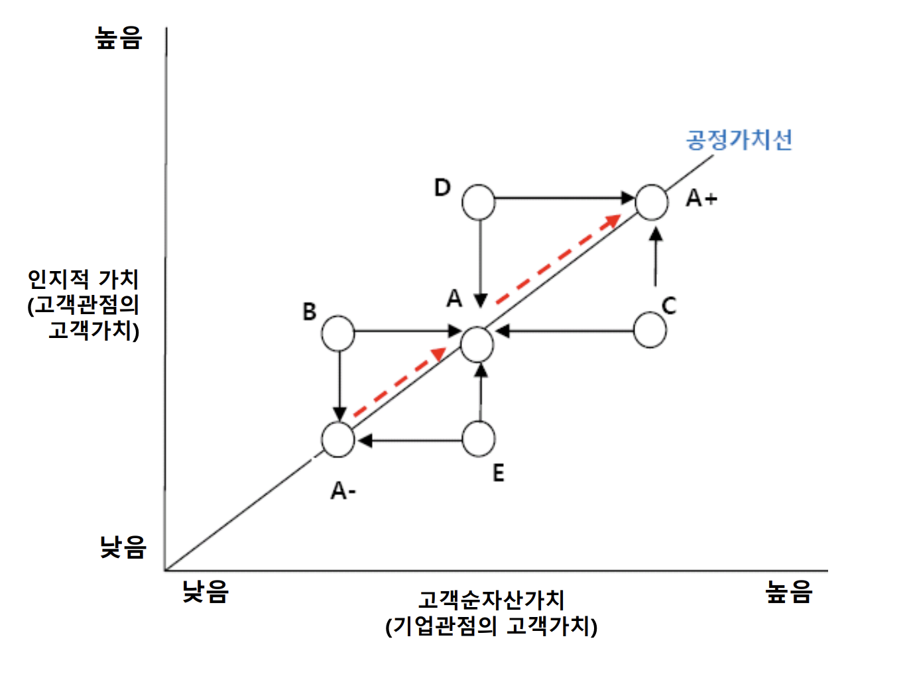
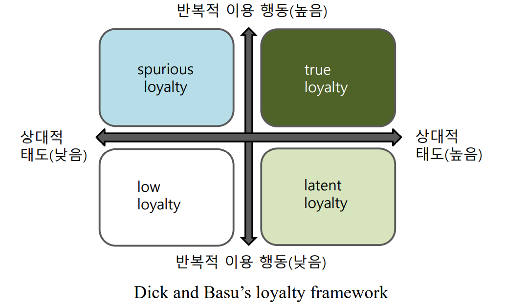

# :clipboard: 고객만족도와 충성도

## :file_cabinet: CRM 고객만족&불만족
### 01. 정의
어떤 대상에 대한 기대수준(Expectation), 실제경험(Exroerience)의 차이에서 발생하는 불일치 정도 영향

### 02. 고객만족 구조
- 1단계 : 제품, 서비스, 종업원 성과
- 2단계 : 고객의 만족
- 3단계 : 고객유지, 충성도 상승
- 4단계 : 매출, 이익 상승

### 03. 고객만족 측정
- 리커트(Likert) 척도 : 5~7점 체크 설문
- ACSI 척도
  

### 04. 고객만족 측정이후
- 선행요소의 완전성 : 고객순자산가치(품질, 브랜드, 상호관계)에 대한 측정 필요
- 만족도의 상대성 필요 : 경쟁 기업의 만족도를 추가 관리
- 점수 개선을 위한 행위 고민
- 전략의 방향을 선택
  - 공격적 고객만족 전략 : 시장확대, 시장점유율 확대
  - 방어적 고객만족 전략 : 이탈장벽 형성, 고객만족 증대

### 05. 고객만족 관리
심리적 백신접족으로 기대관리(Expectation Management)를 시행

---

## :file_cabinet: CRM 고객충성도
### 01. 정의
기업, 제품/서비스에 대한 애착, 애정의 감정상태

### 02. 고객충성도 특징
- 상호성 : 충성도는 일방향적으로 일어나지 않는다
  

- 다중성 : 충성도는 일대일이 아닌 다대다로 일어난다

### 03. 고객충성도의 형태
잠재적로열티, 초우량로열티, 비로열티, 타성적로열티가 존재

### 04. 고객충성도의 단계
- 인지적 충성도 : 특정 브랜드가 떠오름
- 감정적 충성도 : 특정 브랜드가 좋아짐
- 능동적 충성도 : 특정 브랜드를 계속 쓰고 싶음
- 행위적 충성도 : 특정 브랜드를 지속적으로 구매, 추천

### 05. 고객충성도 측정방법
- 순추천지수(NPS) : 고객이 타인에게 추천하고자 하는 의지의 측정(11단계)
- 한국순추천지수(KNPS) : NPS의 한국버전으로 10단계

### 06. 측정식
측정식 : NPS

> NPS = 추천고객비율 - 비추천고객비율 (10점만점)

- 비추천고객 : 0~6
- 추천고객 : 7,8
- 중립고객 : 9,10

측정식 : KNPS

> KNPS = 추천고객비율 - 비추천고객비율 (7점만점)

- 비추천고객 : 0~5
- 추천고객 : 6,7
- 중립고객 : 5

결과
- 평균적인 기업 : 5~10%
- 평균 이상인 기업 : 10~50%
- 우수한 기업 : 50~80%

측정유의점
- 측정시 NPS외에는 거의 물어보지 말것
- 측정시 목표고객에게 높은 응답률을 얻어야 정확한 진단 가능
- 측정시 잦은 측정 필요
- 측정시 실제 고객 행동과 연계되는지 확인

### 07. 특징
- 조직성과와 직접적인 상관관계를 보이지 않는 경우가 많음
- 실행이 쉬움
- 주주보고서 내의 지표로 활용

### 08. 측정이후
- 선행요소의 완전성 : 고객순자산가치(품질, 브랜드, 상호관계)에 대한 측정 필요
- 만족도의 상대성 필요 : 경쟁 기업의 만족도를 추가 관리
- 점수 개선을 위한 행위 고민

## :file_cabinet: 고객만족도 고객충성도 관계
- 산업별로 세부분석에 들어가면 양상이 다르게 나타남 (경쟁사와의 상대적인 순위가 중요)
- 특정산업은 고객 만족도와 충성도가 시장 수익률과 관계가 없을 수도 있다

