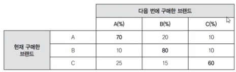

# :clipboard: 고객분석

## 01. 전통적 지표
기업매출과 관련된 지표

### 시장점유율
> 시장점유율(%) = 100 X 기업매출 / 시장규모

- 기업매출 : 기업의 내부기록을 통해 획득
- 시장규모 : 시장조사보고서나 경쟁업체에서 획득

### 매출성장
> 매출성장(%) = 100 X 기간 T의 기업매출/기간 T-1의 기업매출

- 기간 T의 기업매출 : 내부기록을 통해 획득
- 기간 T-1의 기업매출 : 내부기록을 통해 획득

## 02. 고객획득지표
전개된 캠페인 별로 산출되는 고객획득지표

### 획득율
> 획득율(%) = 100 X 획득한 가망고객수 / 타겟팅한 가망고객수

- 획득한 가망고객수 : 내부기록에서 결정됨
- 타겟팅한 가망고객수 : 내부기록이나 시장조사데이터로 결정

### 획득비용
> 획득비용($) = 획득에 대한 지출 / 획득한 가망고객의 수
- 획득에 대한 지출 : 내부기록에 의해 결정
- 획득한 가망고객의 수 : 내부기록에 의해 결정

## 03. 고객활동지표
구매 행위 이상을 고려하기 위해 고객이 어떻게 활동하고 있는지에 대한 지표

### 평균구매간격
구매와 구매 사이의 평균 경과시간
> 평균구매간견 = 1 / 한달에 구매한 횟수 X 기간단위(1달, 1년)

### 고객유지율&이탈율
유지율은 고객의 평균유지율로 근사됨

> 고객유지율(%) = 기간 T에서 구매코호트 고객수 /기간 T-1 동안 구매코호트 총 고객수

코호트 : 통계적으로 동일한 특생의 그룹

- 기간 T에서 구매코호트 고객수 : 내부기록에 의해 결정
- 기간 T-1 동안 구매코호트 고객수 : 내부기록에 의해 결정

### 생애 기간
고객에 의해 명쾌하기 명시된 만료일이 없기 때문에 기업은 고객과의 비계약 상황에서 고객이 얼마나 오랫동안 관계를 유지할지 불확실하기에 측정이 중요

> 평균 생애기간 = 시그마 ( 1~N년까지의 고객 ) / 전체고객수

### 활동
> 활동 = (구매기간/전체기간)의 구매기간 중 구매횟수

## 04. 대중적인 고객기반 가치지표
### 고객구매력
> 한 카테고리에서의 고객 구매력 = 모든 구매의 합

### 기업품목점유율(aSRC)
특정 기업에 대한 브랜드 판매량 충성도

> 품목점유율 = 100 X 특정 브랜드의 개수 / 특정 브랜드의 전체시장크기

### 개인품목점유율(iSRC)
개별 고객에 대한 특정 브랜드의 판매량 중요성

> 개인품목점유율 = 특정고객의 전체구매(다른기업포함) / 전체고객

### 전체지갑점유율(aSW)
고객이 해당 카테고리에서 모든 브랜드에 대한 구매한 총 금액 대비 중심 브랜드가 차지하는 매출액

> 전체지갑점유율 =

### 개인지갑점유율(iSW)
개인 고객에 대한 특정 브랜드의 매출(금액)

> 개인지갑점유율 =

### 전환매트릭스

## 05. 전략적 고객기반 가치지표
### RFM
### 과거 고객가치
### 고객생애가치
### 고객순자산가치

# :clipboard: 고객가치평가의 전략적 활용
## 01. 고객세분화
## 02. 수익성 예측
## 03. 고객군별 마케팅 예산 배분
## 04. 고객이탈 예측
## 05. 고객전환전략 수립 및 집행
